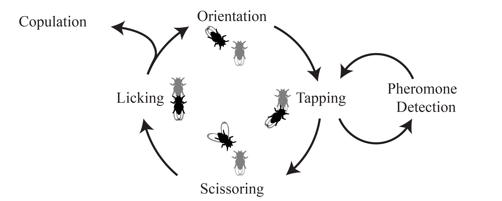
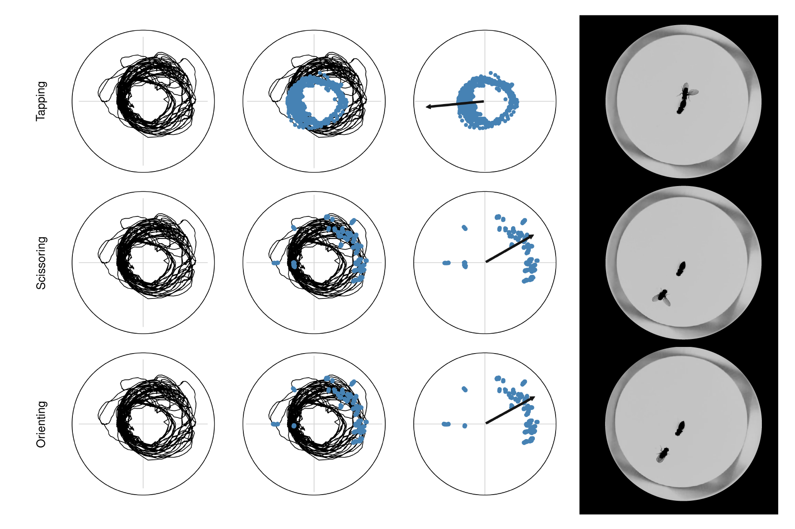

# Introduction

Courtship in *Drosophila melanogaster* consists of an extremely rich series of
stereotyped behaviors, the analysis of which---in conjunction with genetic
and neural manipulations---can provide insights into the sensory stimuli and
brain circuitry that coordinate complex behavioral decisions.

Courtship has
traditionally been hand-scored in a binary manner, whereby a male fly is either
courting or not courting a target female. The vast majority of studies which
use courtship as a behavioral output use these simple binary data to calculate
two main parameters: the fraction of time a male spends courting a female
(termed the courtship index) and the time taken for the male to initiate
courtship (called the courtship latency). While these parameters have been
instrumental in advancing diverse areas of research, they are
not capable of capturing the the full complexity and relationship of individual
courtship behaviors to one another.

The software in this repository (*drosophila-courtship*), is designed to help analyze the relationships between individual courtship behaviors displayed by male flies. Particularly, it is useful for tracking males who are courting females that are fixed in place (Video 1).

<video width="640" height="480" controls>
  <source src="_static/tracking-with-stats.mp4" type="video/mp4">
</video>

<strong>Video 1. Example of tracked flies.</strong> <em>The following statistics are displayed below the male: 1. Velocity (green) 2. Male-to-female distance (blue) 3. Full wing angle (cyan) 3. Left wing angle (yellow) 4. Right wing angle (magenta).</em>

We can use this tracking information to determine which video frames a male was engaging in a specific behavior, by generating classifiers using the `courtship.ml` package (Video 2).

<video width="640" height="480" controls>
  <source src="_static/wing-extensions.mp4" type="video/mp4">
</video>

<strong>Video 2. Examples of video frames containing 'wing extensions'.</strong>

And then re-map this information back into spatial coordinates using the `courtship` and `courtship.stats` modules (Figure 1).

<strong>Figure 1. Male courtship behavior positioning.</strong><em>The female has been rotated such that her anterior-posterior axis is pointing toward the right in each of the plots.</em>

Finally, we can use these behavioral classifications to understand how flies transition from one behavior to another, using the `courtship.stats` module.
