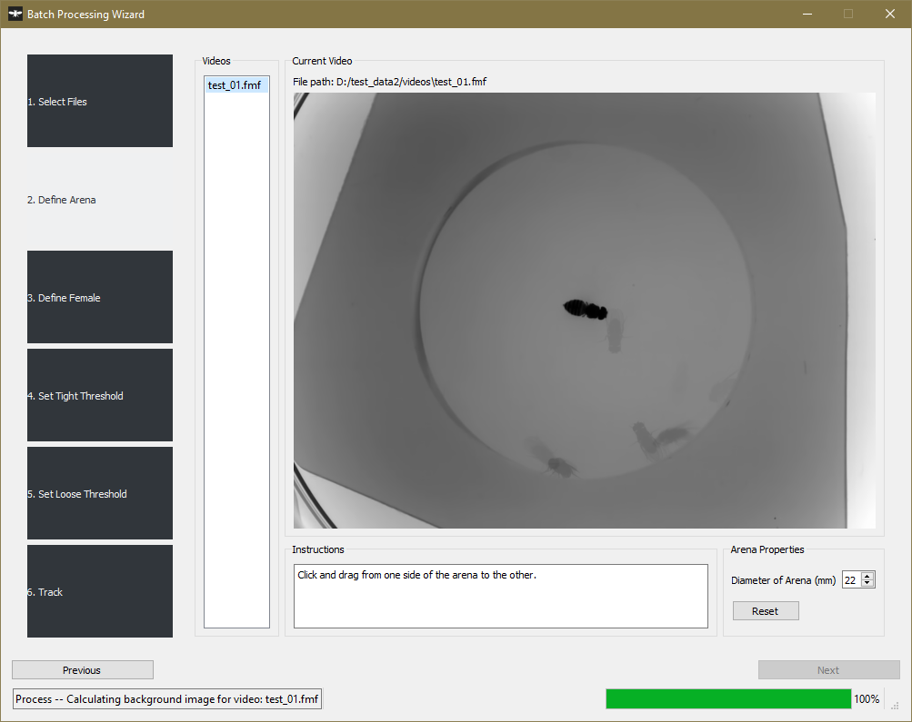

# Tutorial

## Using the GUI

To use the GUI, type the following in a terminal:

~~~bash
courtship-app
~~~

This will launch the GUI, and take you to the main user interface (Fig 1).

**Figure 1. Main user interface.**

The main interface will only show a video, video navigation buttons/slider, and a File Explorer tree view initially. Tracking statistics and behavioral classifications will open if a FixedCourtshipTrackingSummary (.fcts) file and its associated video are opened.

Use the 'File' menu to open a video, or open a file directory in the 'File Explorer' tree view by pressing `Ctrl+O`. If a video has already been tracked, you can open that video and tracking summary (.fcts) also throught the 'File' menu.

The main utility of this GUI is to track a set of videos. To track videos, go to 'Tracking->Batch Processing'. This will open the Batch Processing Dialog window (Fig 2).

**Figure 2. Batch Processing Dialog window.**

## Analyzing Data
