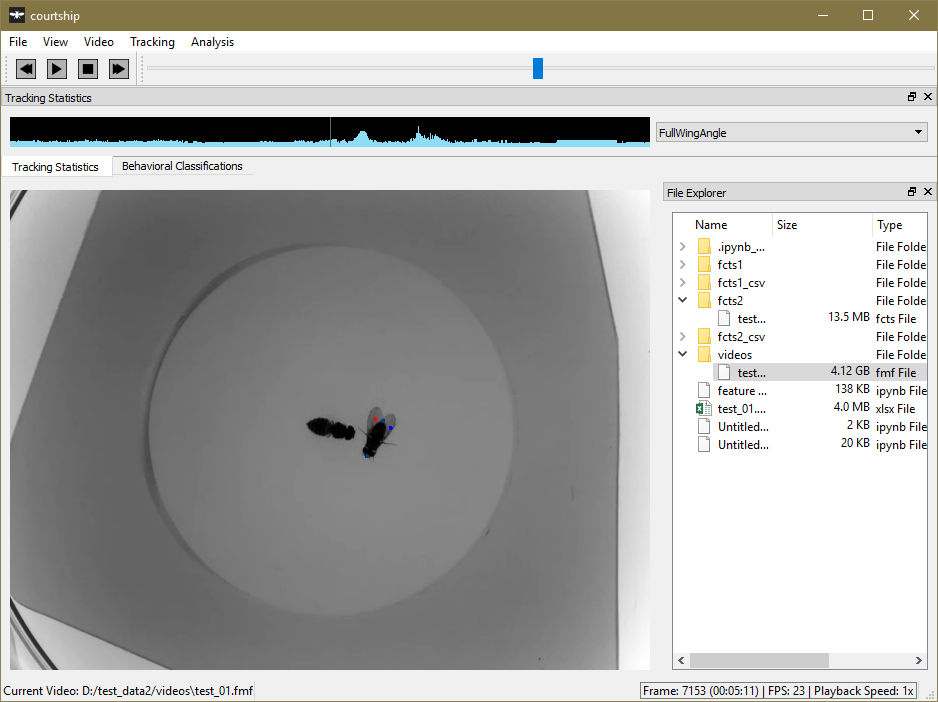
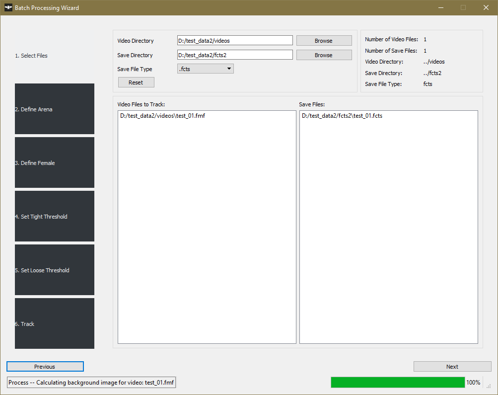
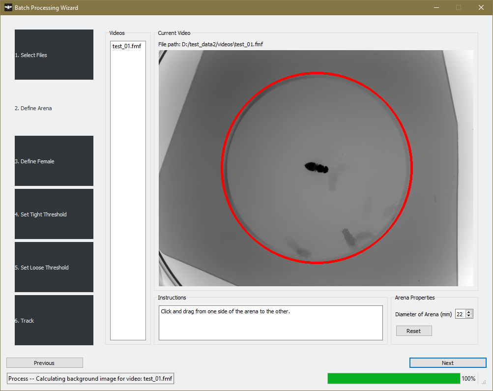
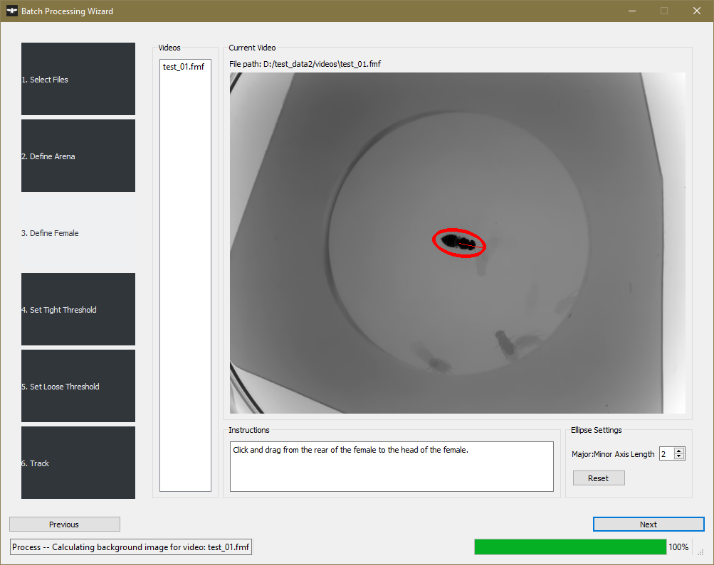
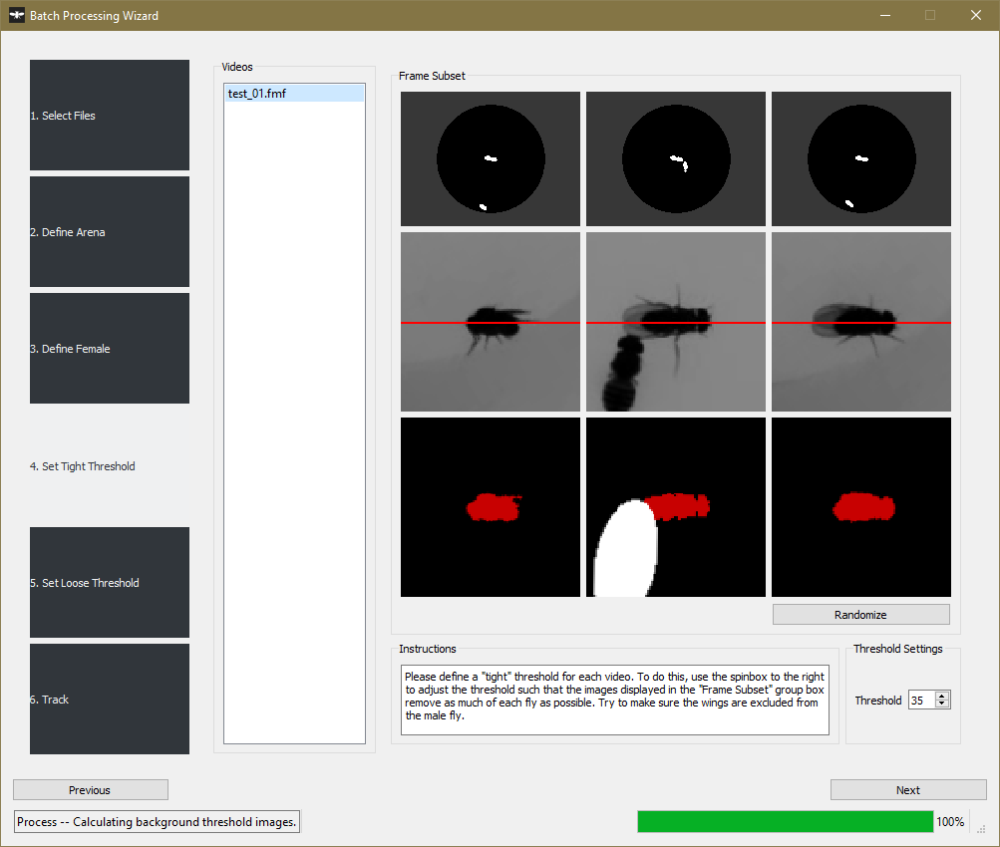
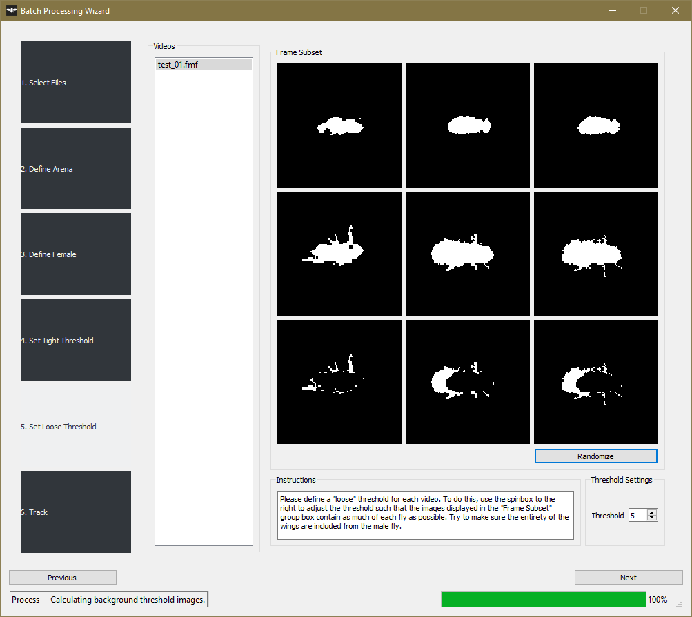
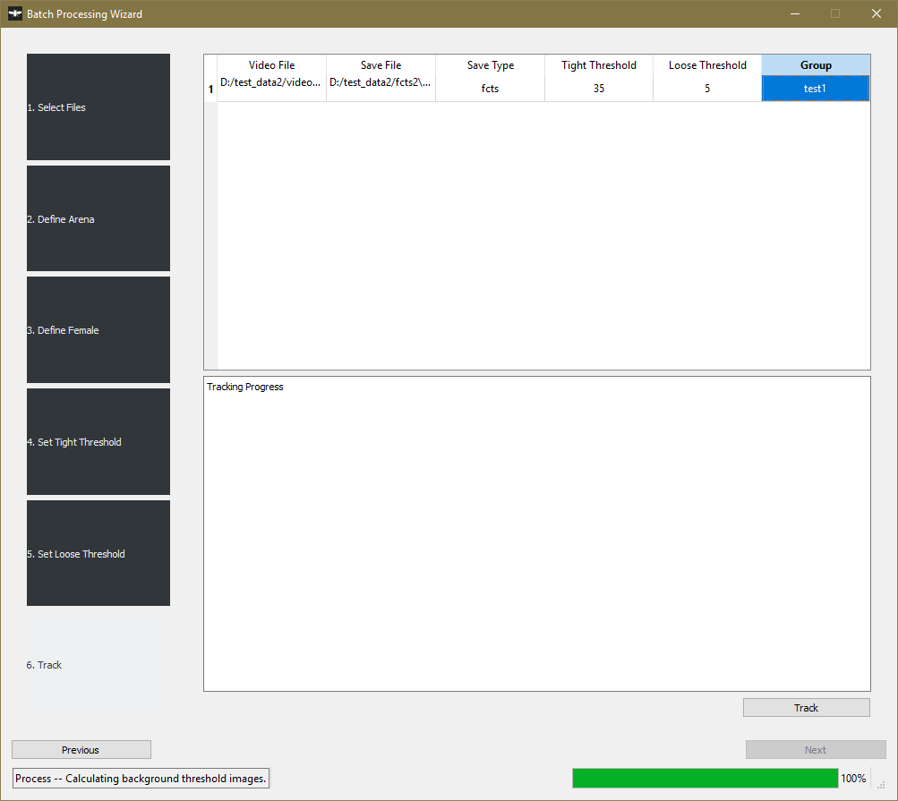

# Tutorial

## Using the GUI

To use the GUI, make sure that the 'courtship' environment is activated, and then type the following in a terminal:

~~~bash
courtship-app
~~~

This will launch the GUI, and take you to the main user interface (Fig 1).

**Figure 1. Main user interface.**

The main interface will only show a video, video navigation buttons/slider, and a File Explorer tree view initially. Tracking statistics and behavioral classifications will open if a FixedCourtshipTrackingSummary (.fcts) file and its associated video are opened.

Use the 'File' menu to open a video, or open a file directory in the 'File Explorer' tree view by pressing `Ctrl+O`. If a video has already been tracked, you can open that video and tracking summary (.fcts) also throught the 'File' menu.

The main utility of this GUI is to track a set of videos. To track videos, go to 'Tracking->Batch Processing'. This will open the Batch Processing Dialog window (Fig 2). I have tracked up to 120 videos at a time using this dialog.

**Figure 2/Step 1. Batch Processing Dialog window.** *(Step 1) Select a directory containing video files (.fmf) to track, select a directory to save tracked files, and select a save file type.*

## Batch Processing Wizard

### Step 1

Within the batch processing dialog, you will be led through 6 steps. In the first step (Figure 2/Step 1), you will be asked to select a directory containing the videos that you would like to track. I'd recommend creating a `videos` folder that only contains the videos you're tracking. You will also be asked to select a save directory and save file type; I'd also recommend creating a folder specifically for holding tracking files.

The tracking software allows you to save files as either `.fcts` or `.xlxs`. `.fcts` files are nothing more than pickled python objects, so if you plan on doing your analyses outside of python, save tracked files as `.xlsx`; otherwise, save as `.fcts`. You can always convert `.fcts` files to `.xlsx` later.

### Step 2

**Step 2. Define arenas.**

In the next step, you will be asked to define an arena for each of the videos you're tracking.

As you click through each video, a background image will be calculated for that video (which is what the progress bar at the bottom of the GUI is showing).

Click and drag from one side of the arena to the other. Make sure the arena is defined so that it is as close to the actual arena as possible; any regions outside of the arena will be excluded from tracking. You can click and drag as many times as you'd like; if you aren't happy with the arena you've defined, just try again.

You won't be able to proceed to the next step until an arena has been defined for every video to-be-tracked.

Note: only circular arenas are allowed at this time.

### Step 3

**Step 3. Define female orientation.** _Click and drage from the female's rear to her head. The ellipse that is drawn should have line emanating from its center to the female's head if it has been drawn in the proper orientation._

In the next step, you are asked to define the anterior-posterior axis of the female. Click and drag from the female's rear to her head. If the female you are using is wider than the current ellipse, decrease the ellipse's Major:Minor axis length; if the female is thinner, increase the ratio.

The final ellipse should display a line over the female's head. If you aren't satisfied with the current ellipse, just click and drag until you are.

You will not be able to proceed to the next step until ellipses have been defined for all female's in all videos.

### Step 4

**Step 4. Define a 'tight threshold'.** _A 'tight threshold' should be defined such that only the male's body is visible in the image following thresholding (these are the red areas in the third row of the `Frame Subset` group box)._

Using the spinbox in the lower right hand side of the window define a 'tight threshold': this is a pixel threshold used to identify the male's body and should be low enough to exclude the male's wings.

The first row shows you which areas are below the threshold in the arena you've defined. You can see that both the male and female are visible in all three images. The area outside of the arena is excluded and shown in gray.

The second row shows each of the males detected in each of the frames. Their anterior-posterior body axis should be aligned along the red horizontal line in the center of each frame.

The third row shows the areas of the detected male that are below the threshold. Try to make sure that the threshold you've set excludes the male's wings.

### Step 5

**Step 5. Define a 'loose threshold'.** _The 'loose threshold' should be defined so that as much of the male as possible is detected._

Using the spinbox in the lower right hand side of the window define a 'loose threshold': this is a pixel threshold used to identify the entirety of the male, including his wings, body, and (potentially but not necessarily) legs.

The first row shows the male's body (as determined by using the 'tight threshold' that you defined in Step 4).

The second row shows the area occupied by the male, as determined using the 'loose threshold'.

The third row shows you row 1 subtracted from row 2. This should be a 'wing image', and contain mostly pixels that can be attributed to regions occupied by the male's wings. This is the image used to determine male wing position.

### Step 6

In the last step, you don't technically have to do anything, except hit `Track`..

However, I would recommend that you set a group name for each of the videos that you are tracking. To do this, double click in the `Group` cell on the spreadsheet above the `Tracking Progress` log. This will allow you to easily place data into an Experiment and have it sorted and separated out into groups automatically.

Once you've set your groups, then hit `Track`.

You should see tracking progress appear in the `Tracking Progress` log below the spreadsheet widget. It generally takes the same amount of time to track a single video as it is long (ie. it takes ~10 min to track a 10 min video @ 24 fps).

## Analyzing Data

Once you have all of you videos tracked, it's time to analyze your data!..
